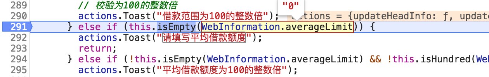

# jsUtils

## test

## 背景

在做表单的时候，会遇到很多的表单项的验证工作，几乎很多验证都是重复的，有一个比较好的[lodash](https://github.com/lodash/lodash)库来做了这些工作，但是里面有些方法和实际的业务工作有些不符。比如，`lodash.isEmpty(2) // true`是会认为是空的。这显然与实际的业务是不符的。另外还有一些数字校验、文字校验等一些常用的校验方法，想结合[lodash](https://github.com/lodash/lodash)做一个自己的 jsUtils 库，里面封装一些业务上常用的校验方式，这样比较有利于业务的开发。

## 简介

在 `lodash` 基础上扩展的一些 jsUtils，`lodash`自身原有的一些方法仍然能用。其中`isEmpty`方法被重写了。 将重新封装的方法做成了一个名为`jsutils-100`的 npm 包，已经发布到 npm 仓库中，大家可以像使用其他 npm 包一样方便的来使用新封装的这个 jsUtils 包。

**同时也不必再去安装`lodash`包。**

同时该项目中添加了单元测试来保证每个方法的正确性，大家可以放心大胆的来使用。单元测试为代码质量进行保驾护航。

> 顺便简单说一下单元测试</br>
> 单元测试是是开发者编写的一小段代码，用于检验被测代码的一个很小的、很明确的功能是否正确，通常而言，一个单元测试是用于判断某个特定条件（或者场景）下某个特定函数的行为。</br>
>
> 简单说下单元测试的好处：
>
> - 单元测试不但会使你的工作完成得更轻松。而且会令你的设计会变得更好，甚至大大减少你花在调试上面的时间
> - 提高代码质量
> - 减少 bug，快速定位 bug
> - 放心地修改、重构
>
> 单元测试提倡的是<u>测试驱动开发-测试先行</u>。</br>
>
> 测试驱动开发的基本思想就是在开发功能代码之前，先编写测试代码，然后只编写使测试通过的功能代码，从而以测试来驱动整个开发过程的进行。这有助于编写简洁可用和高质量的代码，有很高的灵活性和健壮性，能快速响应变化，并加速开发过程。</br>
>
> 测试驱动开发的基本过程如下：</br>
> ① 　快速新增一个测试</br>
> ② 　运行所有的测试（有时候只需要运行一个或一部分），发现新增的测试不能通过</br>
> ③ 　做一些小小的改动，尽快地让测试程序可运行，为此可以在程序中使用一些不合情理的方法</br>
> ④ 　运行所有的测试，并且全部通过</br>
> ⑤ 　重构代码，以消除重复设计，优化设计结构</br>
> 简单来说，就是不可运行/可运行/重构——这正是测试驱动开发的口号。
>
> 另外难点就是 mock，在较复杂功能的测试时，难点就是 mock 了。这时候写单元测试可能就会变成累赘，也真是因为这个原因，在之前的项目中也就没有很好地贯彻下来。不过在  纯逻辑功能函数中，使用单元测试会是非常棒的。建议在这种情况下，可以体验一下。

## ✨ 特性

- 开箱即用的高质量的组件。
- `lodash`自身原本方法都可使用。
- 扩展`lodash`方法，增加更加适合业务的方法。
- 增加常用的表单校验方法。
- 支持扩展丰富。

## 📦 安装

```bash
npm install jsutils-100 --save
```

## 🔨 示例

```jsx
import jsUtils from "jsutils-100";
jsUtils.isEmpty(""); // true
```

## 详细介绍

在`jsutils-100`项目中，重写了`isEmpty`方法，添加了一些常见的表单校验中会用到的方法，目前增加了以下方法：

- `isHundred`
- `isDigit`
- `isInteger`
- `isEmptyOneOfTwo`
- `isChinese`
- `isEmail`
- `isPhoneNumber`
- `isIdNumber`
- `isIp`
- `isUserName`
- `isPassword`

同时也希望大家可以将这个项目补充起来，将自己在工作中常用到的校验方法添加到这个项目中来，共同来维护这个库，这样在不久的将来，我们再开发业务时，就不会为校验而担忧。

### 1. `isEmpty`方法

> 检查 value 是否为一个空对象，集合，映射或者 set。 判断的依据是除非是有枚举属性的对象，length 大于 0 的 arguments object, array, string 或类 jquery 选择器。
> 对象如果被认为为空，那么他们没有自己的可枚举属性的对象。

以上是 Lodash 官网介绍。基于这个介绍，我们  得知**数字**是会被认为是空的，也就是`_.isEmpty(1);// => true`。这就有点不符合我们业务中经常遇到的，输入框输入内容，输入数字在主观上我们是认为有值的 ，不能被认为为空。

所以这也是我准备自己封装`jsUtils`的初衷， 要做一套从业务角度出发的`jsUtils`。

重写的`isEmpty`方法弥补了`Lodash`中将数字认为是空的情况。

像这样：

```js
it("isEmpty", () => {
  expect(jsUtils.isEmpty(0)).toBeFalsy();
  expect(jsUtils.isEmpty("")).toBeTruthy();
  expect(jsUtils.isEmpty("0")).toBeFalsy();
  expect(jsUtils.isEmpty(undefined)).toBeTruthy();
  expect(jsUtils.isEmpty(null)).toBeTruthy();
  expect(jsUtils.isEmpty("ss")).not.toBeTruthy();
});
```

### 2. `isHundred`方法

`isHundred`方法是来验证`value`值是否为 100 的倍数。

用法像这样：

```js
it("验证是否为100的整数倍", () => {
  expect(jsUtils.isHundred(101)).toBeFalsy();
  expect(jsUtils.isHundred("0")).toBeTruthy();
  expect(jsUtils.isHundred("200")).toBeTruthy();
  expect(jsUtils.isHundred("1200dd")).toBeFalsy();
  ...
});
```

### 3. `isDigit`方法

`isDigit`方法是用来验证 value 是否为支持小数点的数字。

用法像这样：

```js
expect(jsUtils.isDigit("3d4")).toBeFalsy();
expect(jsUtils.isDigit("3drr4")).toBeFalsy();
expect(jsUtils.isDigit("")).toBeFalsy();
expect(jsUtils.isDigit(null)).toBeFalsy();
expect(jsUtils.isDigit(undefined)).toBeFalsy();
...
```

### 4. `isInteger`方法

`isInteger`方法是用来验证 value 是否为不支持小数点的数字。

用法像这样：

```js
expect(jsUtils.isInteger("11d23")).toBeFalsy();
expect(jsUtils.isInteger("11dd45")).toBeFalsy();
expect(jsUtils.isDigit("")).toBeFalsy();
expect(jsUtils.isDigit(null)).toBeFalsy();
...
```

### 5. `isEmptyOneOfTwo`方法

`isEmptyOneOfTwo`方法是用来验证 value1 和 value2 二者有一个不为空即可返回 true，其中当 value1 为数组时，必须数组中的每个值都不为空，value1 才不为空。

用法像这样：

```js
expect(jsUtils.isEmptyOneOfTwo(3, 4)).toBeFalsy();
expect(jsUtils.isEmptyOneOfTwo(3, "hehe")).toBeFalsy();
expect(jsUtils.isEmptyOneOfTwo(["56", 4], "23")).toBeFalsy();
expect(
  jsUtils.isEmptyOneOfTwo(["89", "90", "34", "45", "450"], "")
).toBeFalsy();
...
```

### 6. `isChinese`方法

`isChinese`方法是用来验证如果输入内容，那么输入内容只能是汉字。

用法像这样：

```js
expect(jsUtils.isChinese("？")).toBeTruthy();
expect(jsUtils.isChinese(".")).toBeFalsy();
expect(jsUtils.isChinese("ddd")).toBeFalsy();
expect(jsUtils.isChinese("undefined")).toBeFalsy();
expect(jsUtils.isChinese("贺贺")).toBeTruthy();
...
```

### 7. `isEmail`方法

`isEmail`方法是用来验证邮箱输入是否正确。

用法像这样：

```js
expect(jsUtils.isEmail(undefined)).toBeFalsy();
expect(jsUtils.isEmail("")).toBeFalsy();
expect(jsUtils.isEmail("zhulinger520@163.com")).toBeTruthy();
expect(jsUtils.isEmail("spring.hehe.v5@gmail.com")).toBeTruthy();
...
```

### 8. `isPhoneNumber`方法

`isPhoneNumber`方法是用来验证是否为手机号码。

用法像这样：

```js
expect(jsUtils.isPhoneNumber()).toBeFalsy();
expect(jsUtils.isPhoneNumber(null)).toBeFalsy();
expect(jsUtils.isPhoneNumber(8723983)).toBeFalsy();
expect(jsUtils.isPhoneNumber(8723983.342)).toBeFalsy();
...
```

### 9. `isIdNumber`方法

`isIdNumber`方法是用来校验有效身份证号码。其中包括 15 位和 18 位，要校验生日、出生地、校验位等。

用法像这样：

```js
expect(jsUtils.isIdNumber("131182199101311221")).toBeTruthy();
expect(jsUtils.isIdNumber("131182199101321221")).toBeFalsy();
expect(jsUtils.isIdNumber("131182199102021221")).toBeFalsy(); // 校验位不对
expect(jsUtils.isIdNumber("131182199102021226")).toBeTruthy(); // 校验位正确
...
```

### 10. `isIp`方法

`isIp`方法是用来校验是否为正确的 IP 地址。

用法像这样：

```js
expect(jsUtils.isIp("192.168.90.257")).toBeFalsy();
expect(jsUtils.isIp("1.2.3")).toBeFalsy();
expect(jsUtils.isIp("0.2.3.0")).toBeTruthy();
expect(jsUtils.isIp("1111")).toBeFalsy();
...
```

### 11. `isUserName`方法

`isUserName`方法是用来校验输入为字母，数字，下划线，减号,点，输入长度为 4-16 位。

用法像这样：

```js
expect(jsUtils.isUserName("spring.hehe.v5")).toBeFalsy();
expect(jsUtils.isUserName("spring-hehe_v5")).toBeTruthy();
expect(jsUtils.isUserName("spring-hehe@v5")).toBeFalsy();
expect(jsUtils.isUserName("234q_sdfaw-werq")).toBeTruthy();
...
```

### 12. `isPassword`方法

`isPassword`方法是用来校验密码强度。

用法像这样：

```js
expect(jsUtils.isPassword("ASD")).toBeFalsy();
expect(jsUtils.isPassword("aA34_sdw#dd")).toBeTruthy();
expect(jsUtils.isPassword("aA34_sdwdd")).toBeFalsy();
...
```

## ⌨️ 本地开发

```bash
$ git clone https://github.com/springHyc/jsUtils.git
$ cd jsUtils
$ npm install
$ yarn test || npm test (单元测试通过则该方法写的没有问题)
```

## 单元测试

`yarn test` or `npm test`

## 构建

`npm run build`

## 发布

`npm run build`
`npm publish`

## 表单校验建议

1. 字段前后端类型一致

有个实际遇到的例子：前后端的类型不一致。背景是：该字段是必填的。由于后端直接返回来的数据是数字`0`,而前端重新填写的数据是字符串`"0"`,而且这个字段前端的校验是:

```js
isEmpty(data) {
  return data == "" || data == null || data === "[]" ? true : false;
}
```

这就导致，返回来的数据，在完全没有改动的情况下，进行保存，就会提示“该字段需要填写”，而当自己重新填写后，就能直接保存了。




> 特别需要注意的一点：`0==""` 为 true，而`0 === ""`为 false。这一点涉及到的是 JavaScript 基础中的强制类型转换（你不知道的 JavaScript 中卷 第一部分 第 4 章中的宽松相等和严格相等），很多时候，我们在开发的时候是没有注意到这一点的。

之前咱们有提到过一点，说开发中的小技巧，我个人觉得，咱们每个人在开发过程中都会遇到各种各样的小 bug，为什么说是小 bug 呢，是因为这样的 bug，我们不重视，但是却常常遇到，稍微一调试，我们就可以改正过来，like 上面的这个小 bug，但有时候，耗费我们很多时间的不仅仅是一些比较难解决的大 bug，这些不起眼的小 bug，也会耗费我们很多时间，所以个人建议，每个人遇到这种类似的小 bug 可以随手记录一下，目前市面上有很多很好用的软件可以用来随手做记录都不错的，like： 简书、有道云笔记、csdn 等等。

2. 尽量做好防御性编程

2.1 null.xxxx 报错
源代码是这样写的：

```js
buttons: [
  {
    text: "关闭",
    styleType: "ordinary",
    onClick: () => {
      type == 1 &&
        (document.querySelector(".editSHA").innerHTML = "修改公钥");
    }
  },
```

在正常情况下，是不会有任何问题，但是有时候会出现下图的情况：


这时候就需要我们做好防御性编程。可以简单的这样写：

```js
if (type == 1 && document.querySelector(".editSHA")) {
  document.querySelector(".editSHA").innerHTML = "修改公钥";
}
```
