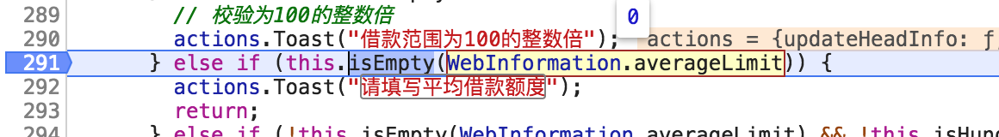

# jsUtils

## 背景

在做表单的时候，会遇到很多的表单项的验证工作，几乎很多验证都是重复的，有一个比较好的[lodash](https://github.com/lodash/lodash)库来做了这些工作，但是里面有些方法和实际的业务工作有些不符。比如，`lodash.isEmpty(2) // true`是会认为是空的。这显然与实际的业务是不符的。另外还有一些数字校验、文字校验等一些常用的校验方法，想结合[lodash](https://github.com/lodash/lodash)做一个自己的 jsUtils 库，里面封装一些业务上常用的校验方式，这样比较有利于业务的开发。

## 简介

在 `lodash` 基础上扩展的一些 jsUtils，`lodash`自身原有的一些方法仍然能用。其中`isEmpty`方法被重写了。 将重新封装的方法做成了一个名为`jsutils-100`的 npm 包，已经发布到 npm 仓库中，大家可以像使用其他 npm 包一样方便的来使用新封装的这个 jsUtils 包。

同时也不必再去安装`lodash`包。

同时该项目中添加了单元测试来保证每个方法的正确性，大家可以放心大胆的来使用。单元测试为代码质量进行保驾护航。

## 使用

使用 npm:

`npm install jsutils-100`

引入:

`import jsUtils from "jsutils-100"`

## 详细介绍

在`jsutils-100`项目中，重写了`isEmpty`方法，添加了一些常见的表单校验中会用到的方法，目前增加了以下方法：`isHundred`、`isDigit`、`isInteger`、 `isEmptyOneOfTwo`、`isChinese`、`isEmail`、`isPhoneNumber`、`isIdNumber`、`isIp`、`isUserName`、`isPassword`方法。

同时也希望大家可以将这个项目补充起来，将自己在工作中常用到的校验方法添加到这个项目中来，共同来维护这个库，这样在不久的将来，我们再开发业务时，就不会为校验而担忧。

### 1. `isEmpty`方法

> 检查 value 是否为一个空对象，集合，映射或者 set。 判断的依据是除非是有枚举属性的对象，length 大于 0 的 arguments object, array, string 或类 jquery 选择器。
> 对象如果被认为为空，那么他们没有自己的可枚举属性的对象。

以上是 Lodash 官网介绍。基于这个介绍，我们  得知**数字**是会被认为是空的，也就是`_.isEmpty(1);// => true`。这就有点不符合我们业务中经常遇到的，输入框输入内容，输入数字在主观上我们是认为有值的 ，不能被认为为空。

所以这也是我准备自己封装`jsUtils`的初衷， 要做一套从业务角度出发的`jsUtils`。

重写的`isEmpty`方法弥补了`Lodash`中将数字认为是空的情况。

像这样：

```js
it("isEmpty", () => {
  expect(jsUtils.isEmpty(0)).toBeFalsy();
  expect(jsUtils.isEmpty("")).toBeTruthy();
  expect(jsUtils.isEmpty("0")).toBeFalsy();
  expect(jsUtils.isEmpty(undefined)).toBeTruthy();
  expect(jsUtils.isEmpty(null)).toBeTruthy();
  expect(jsUtils.isEmpty("ss")).not.toBeTruthy();
});
```

### 2. `isHundred`方法

`isHundred`方法是来验证`value`值是否为 100 的倍数。

用法像这样：

```js
it("验证是否为100的整数倍", () => {
  expect(jsUtils.isHundred(101)).toBeFalsy();
  expect(jsUtils.isHundred("0")).toBeTruthy();
  expect(jsUtils.isHundred("200")).toBeTruthy();
  expect(jsUtils.isHundred("1200dd")).toBeFalsy();
  ...
});
```

### 3. `isDigit`方法

`isDigit`方法是用来验证 value 是否为支持小数点的数字。

用法像这样：

```js
expect(jsUtils.isDigit("3d4")).toBeFalsy();
expect(jsUtils.isDigit("3drr4")).toBeFalsy();
expect(jsUtils.isDigit("")).toBeFalsy();
expect(jsUtils.isDigit(null)).toBeFalsy();
expect(jsUtils.isDigit(undefined)).toBeFalsy();
...
```

### 4. `isInteger`方法

`isInteger`方法是用来验证 value 是否为不支持小数点的数字。

用法像这样：

```js
expect(jsUtils.isInteger("11d23")).toBeFalsy();
expect(jsUtils.isInteger("11dd45")).toBeFalsy();
expect(jsUtils.isDigit("")).toBeFalsy();
expect(jsUtils.isDigit(null)).toBeFalsy();
...
```

### 5. `isEmptyOneOfTwo`方法

### 6. `isChinese`方法

### 7. `isEmail`方法

## 表单校验建议

- 字段前后端类型一致

  有个实际遇到的例子：前后端的类型不一致。背景是：该字段是必填的。由于后端直接返回来的数据是数字`0`,而前端重新填写的数据是字符串`"0"`,而且这个字段前端的校验是:

  ```js
  isEmpty(data) {
    return data == "" || data == null || data === "[]" ? true : false;
  }
  ```

  这就导致，返回来的数据，在完全没有改动的情况下，进行保存，就会提示“该字段需要填写”，而当自己重新填写后，就能直接保存了。

  
  

  > 特别需要注意的一点：`0==""` 为 true

## 单元测试

`yarn test` or `npm test`

## build

`npm run build`

## 发布

`npm run build`
`npm publish`
